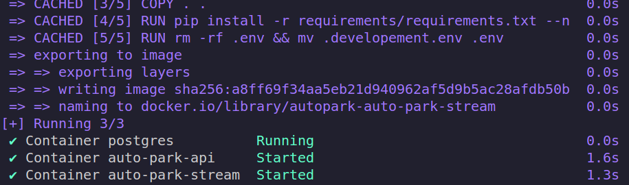

# SmartPark
Auto Park é um estacionamento autônomo que acomoda os carros nas vagas disponíveis e utiliza IA para validar o cadastro dos carros

* [Design](https://www.figma.com/file/bK3G5ll5rnHdS2LEwv4ed3/SmartPark?node-id=0%3A1&t=yP3H130RSt0GWJXg-1)
* [SmartPark Server](./server/README.md)
* [SmartPark Stream](./CamStreaming/README.md)
* [Plate Detection](PlateDetection/README.md)
* [Vagas Detection](Vagas/README.md)

## Iniciando o projeto

O Projeto em si é composto por 3 container que executados simutâneamente geram todas as funcionalidades necessárias para que um park autonomo possa existir.

São eles:

## **smartpark-api**

É um container que executa todas as todas de requisões http, tanto publicas quanto privadas e faz o acesso ao banco de dados utilizando o ORM Prisma.

## **postgres**

É uma instância que roda um banco de dados PostgreSql.

## **smart-park-stream**

Cointener que controla toda a questão de processamento de imagem e comunica como a API /request-access quando requisitada.

## Prerequisitos

- <a href="https://docs.docker.com/engine/install/">Docker compose</a>
- <a href="https://nodejs.org/en/download">Node</a>
- <a href="https://docs.flutter.dev/get-started/install">Flutter</a>


Para inicializar o projeto é necessário rodar todas as instancias utilizando o docker. Então garanta que o tenha o docker compose instalado na sua maquina.

As instâncias auto-park-stream e auto-park-api precisam de um documento proprio chamado _.developement.env_. Este arquivo contem informações de constantes bases para que a aplicação possa iniciar.

Vá até a pasta _/environment_ e copie os arquivos _api.developement.env_ e cole na pasta _server_ e o renomeie para **".developement.env"**

```bash
mv environment/api.developement.env server/.developement.env
```

Agora, na mesma pasta _/environment_ e copie o outro arquivo _stream.developement.env_ e cole na pasta _CamStreaming_ e renomeie para **".developement.env"**

```bash
mv environment/stream.developement.env CamStreaming/.developement.env
```

Agora podemos executar os containers.

```bash
make #inicia o projeto
```


# Swagger

Todas as requisições estão sendo documentada e, caso você esteja com o serviço rodando, podem ser acessadas <a href="http://localhost:3000/api-docs/#/"> AQUI</a>.

Em sua maioria é utiolizado validação de autenticação. No entanto existem apis de testes que permite a vizualização de alguns dados.


# Busness Model Canvas


# Possiveis melhorias

## Motocicletas

Atualmente a datasheet que utilizamos não está preparada para lidar com motocicletas. Não existe uma relevancia significitiva para o meio academico atual em implementar esta melhoria. No entanto é uma possibilidade que pode ser explorada e caso o projeto seja aprimorado para um caso real de uso vale a pena investir.

## Criação de um OCR próprio

Os OCR de código aberto e que podem ser utilizados pela comunidade estão se aperfeiçoando cada dia mais. No entanto, ainda existe inconsistencias para determinadas atividades de leitura de caracteres.
Criar nosso próprio OCR seria interessante tanto para aprendizado quanto para aprimirar o projeto.

## Permitir reports para as vagas

No design inicial foi proposto uma forma de reportar problemas com determinadas vagas. Porém ao decorrer do projeto foi concluido que, por questão de tempos não seria possivel continuar com o escopo inicial. Desta forma, optamos por priorizar atividades mais relevantes para o projeto afim de entregar um MVP.

## Atualização cadastral
## Cadastro de vagas para administrador

A possibilidade de um site web que apenas administradores do estacionamento tenham acessos para que possa ser feito o cadastro das vagas de forma dinâmica. Além disso 

