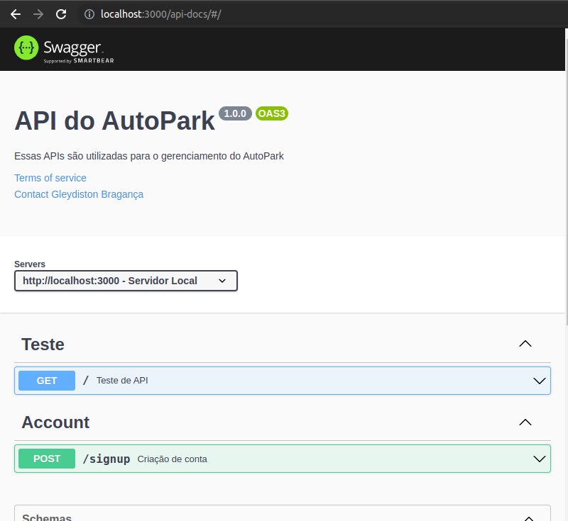

# AutoPark
Auto Park é um estacionamento autônomo que acomoda os carros nas vagas disponíveis e utiliza IA para validar o cadastro dos carros

Modelo:
https://www.figma.com/file/bK3G5ll5rnHdS2LEwv4ed3/AutoPark?node-id=0%3A1&t=yP3H130RSt0GWJXg-1

## Arquitetura do projeto:

## Executando a aplicação

### Prerequisitos

- <a href="https://docs.docker.com/engine/install/">Docker compose</a>
- <a href="https://nodejs.org/en/download">Node</a>
- <a href="https://docs.flutter.dev/get-started/install">Flutter</a>

<code>docker compose up</code>

Isso irá criar uma instância do postgres na sua máquina.

<code>cd server &&
npm install &&
npx prisma generate
</code>

Instala todas as dependências necessárias para a aplicação.

<code>npm run dev</code>

Isso irá subir um servidos na porta localhost:3000

# Swagger

Todas as requisições estão sendo documentada e, caso você esteja com o serviço rodando, podem ser acessadas <a href="http://localhost:3000/api-docs/#/"> AQUI</a>.

Em sua maioria é utiolizado validação de autenticação. No entanto existem apis de testes que permite a vizualização de alguns dados.

